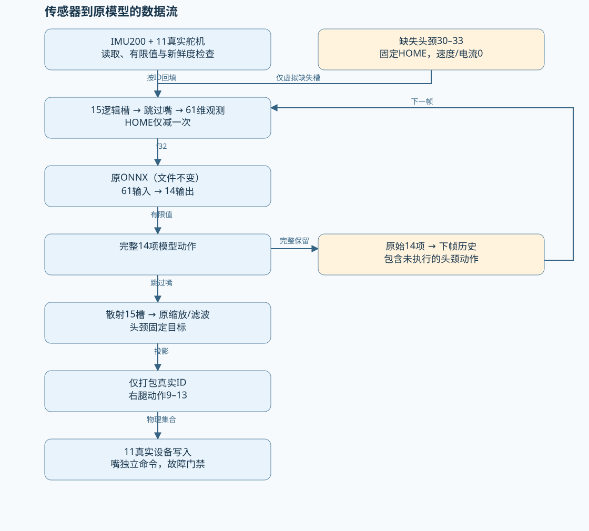
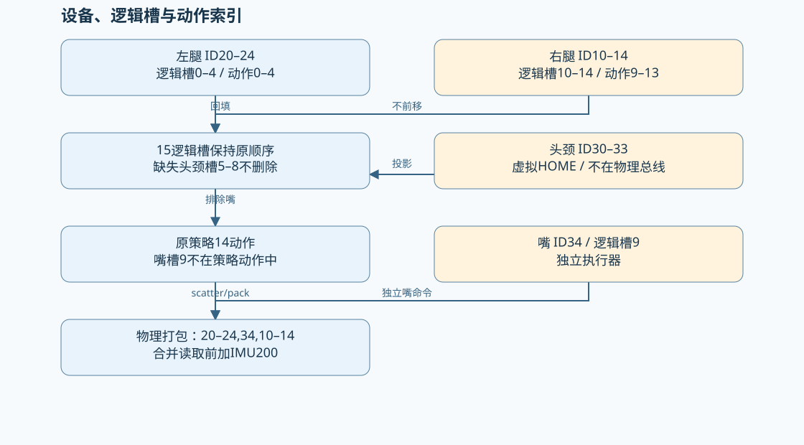
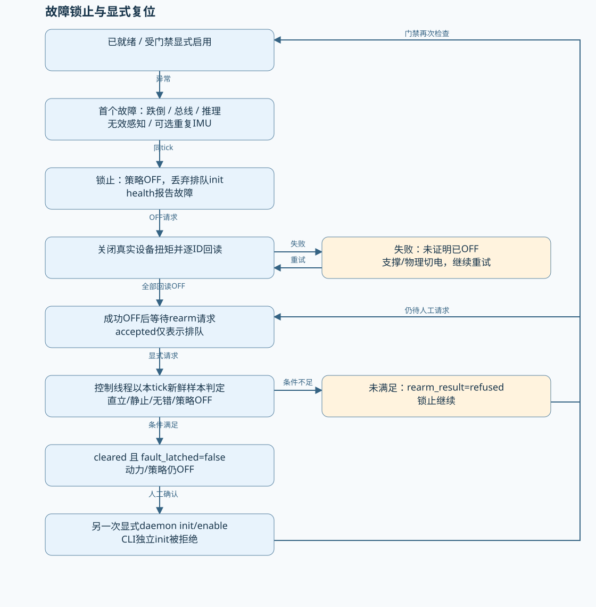
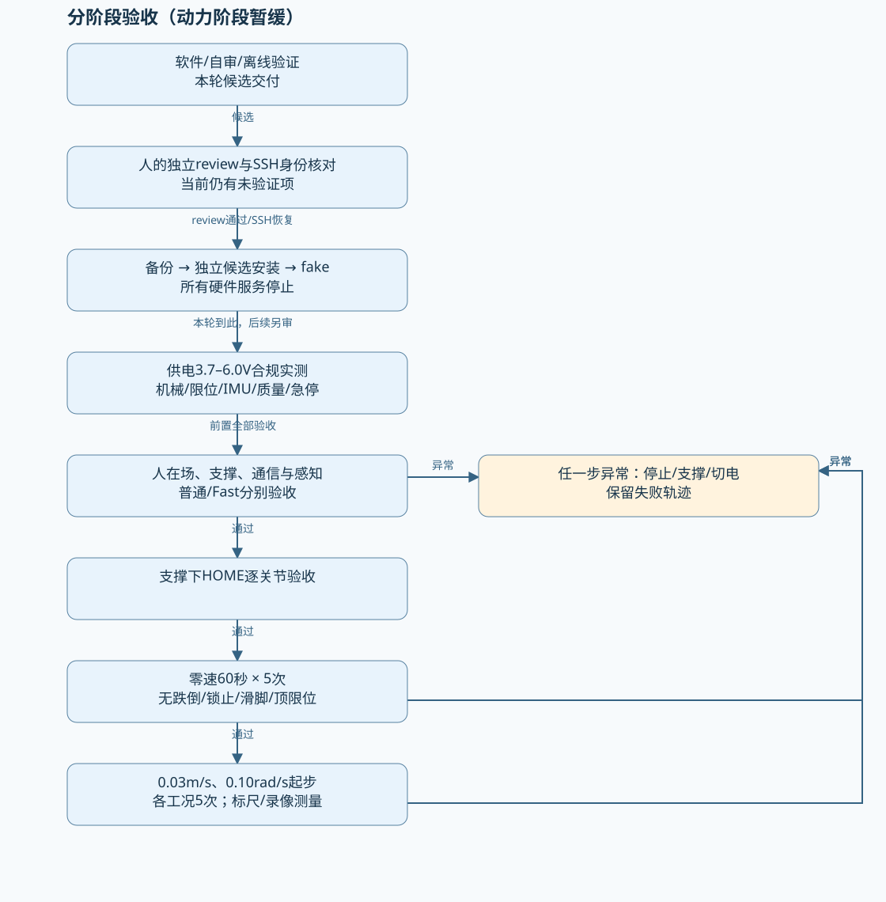
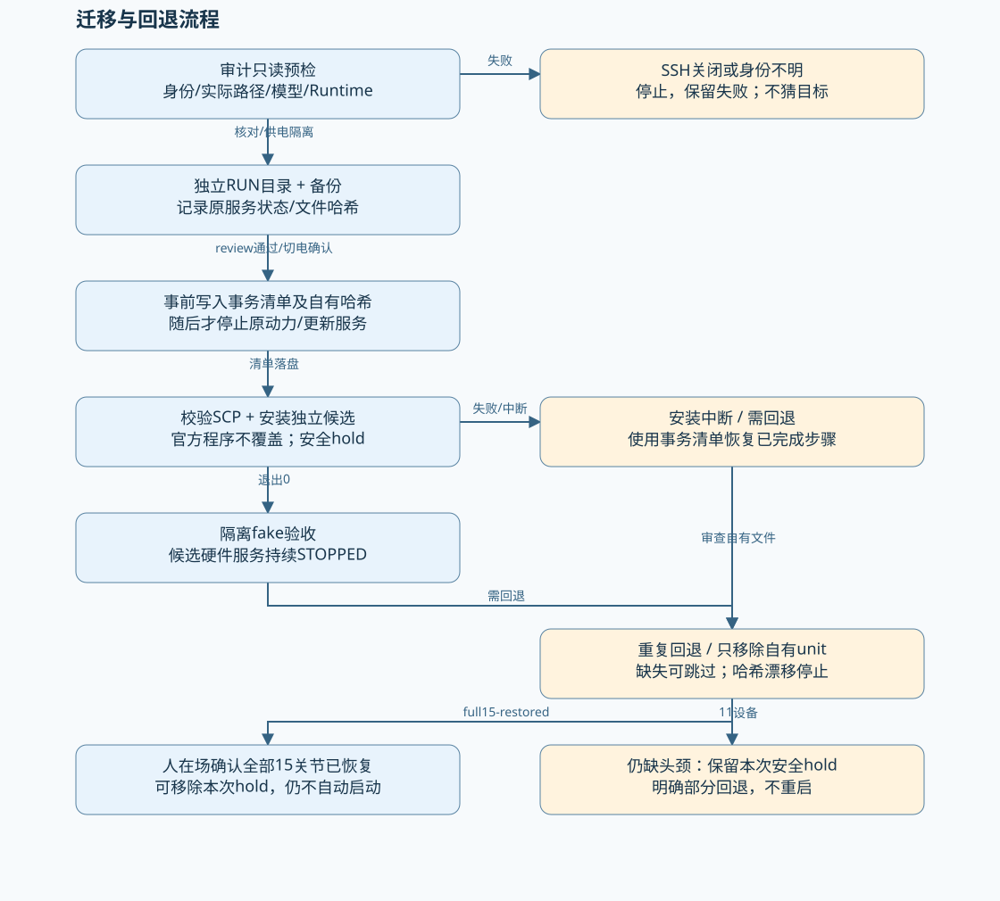
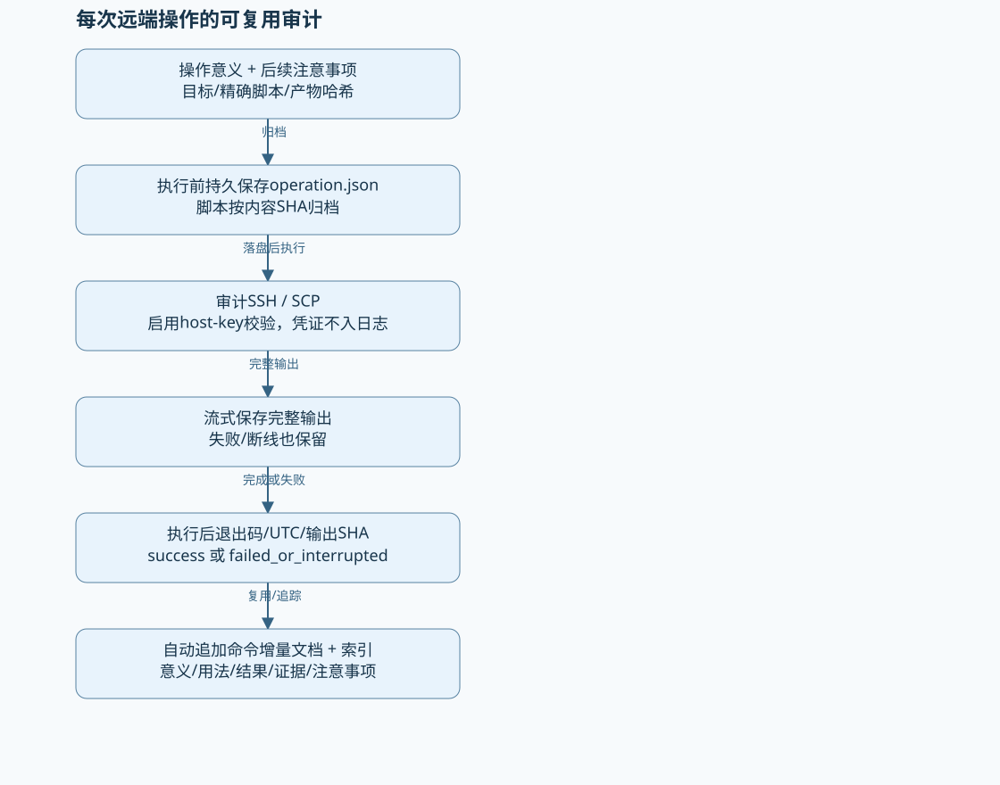

# 流程图册

Mermaid和SVG由同一节点/边定义生成。SVG使用确定性本地排版，无需联网或运行浏览器。

## 传感器到原模型的数据流

[Mermaid源码](sensor-model-dataflow.mmd) · [SVG](sensor-model-dataflow.svg)

## 设备、逻辑槽与动作索引

[Mermaid源码](id-slot-mapping.mmd) · [SVG](id-slot-mapping.svg)

## 故障锁止与显式复位

[Mermaid源码](fault-rearm-state.mmd) · [SVG](fault-rearm-state.svg)

## 分阶段验收（动力阶段暂缓）

[Mermaid源码](staged-acceptance.mmd) · [SVG](staged-acceptance.svg)

## 迁移与回退流程

[Mermaid源码](deployment-rollback.mmd) · [SVG](deployment-rollback.svg)

## 每次远端操作的可复用审计

[Mermaid源码](audit-evidence.mmd) · [SVG](audit-evidence.svg)
